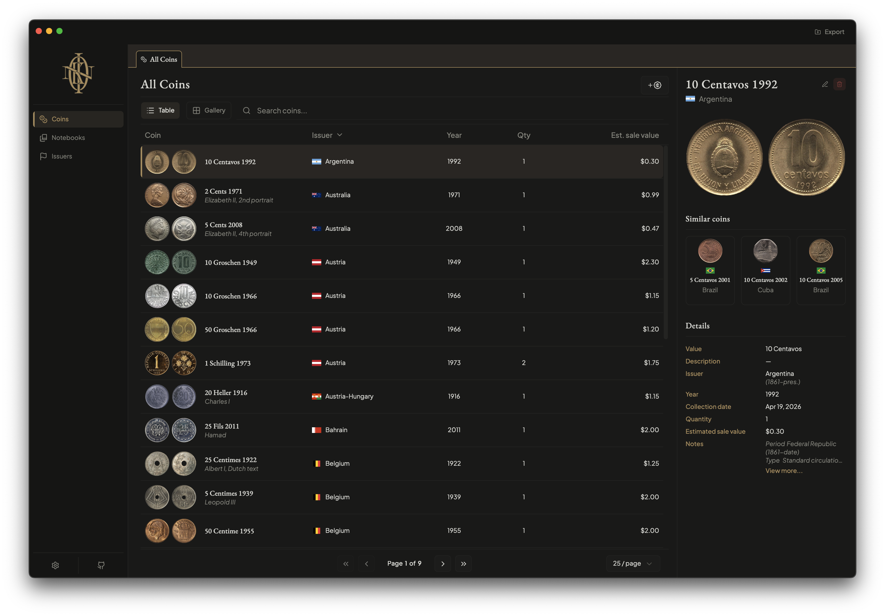
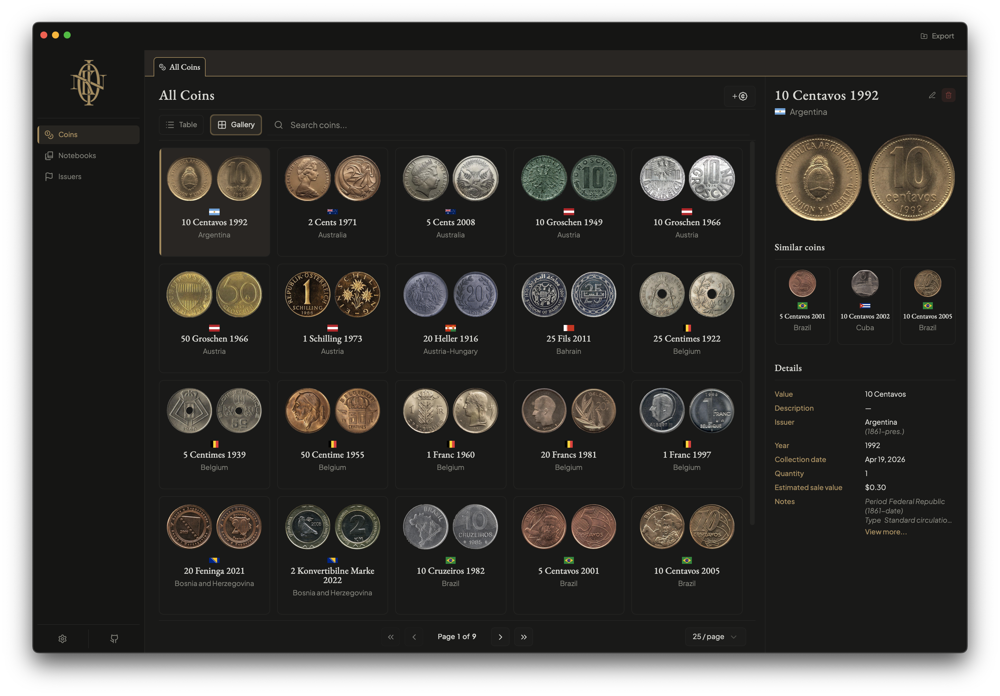
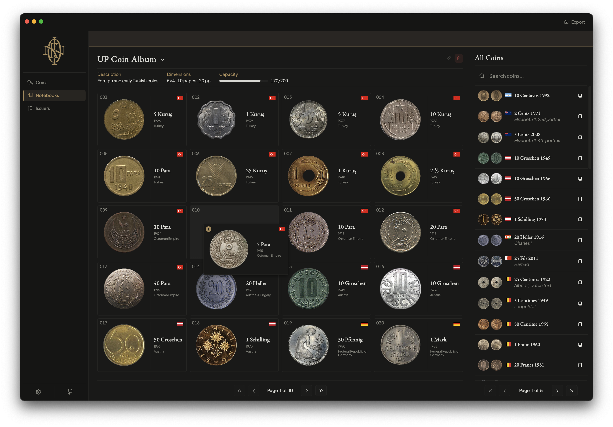
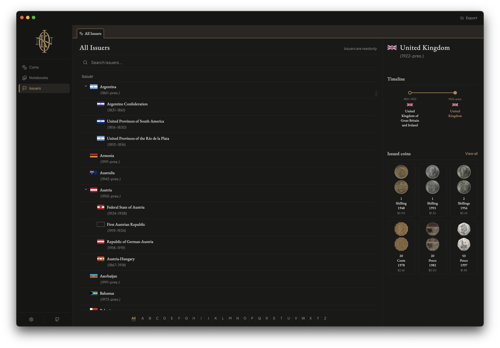

<div align="center">
  

# Koin

**A digital coin cabinet for collectors who want complete ownership of their data.**

[](https://www.gnu.org/licenses/gpl-3.0)


[Overview](#overview) · [Why Koin?](#why-did-i-build-koin) · [Installation](#installation) · [Features](#features) · [Screenshots](#screenshots) · [Technology](#technology) · [Privacy](#privacy) · [Data Sources](#data-sources) · [Contributing](#contributing) · [License](#license)

</div>

---

## Overview

### What is Koin?

Koin is a free and open-source desktop application for managing and organizing coin collections.

Designed around a local-first philosophy, Koin stores your collection on your own machine rather than relying on cloud
services, subscriptions, or vendor lock-in. It provides collectors with tools to catalog, organize, photograph, and
explore their collections while retaining complete ownership of their data.

Koin is not intended to be a pricing platform, investment tracker, marketplace, or grading authority. Instead, it
focuses on helping collectors build a personal, well-organized digital cabinet for their coins.

Koin is a digital coin cabinet. It exists to help you document, organize, and enjoy your collection, regardless of
whether your coins are rare silver crowns, circulation finds, foreign pocket change, or historical curiosities.

---

## Why did I build Koin?

Cataloging coin collections is a challenge by itself, and most readily available solutions are either industrial-looking
outdated applications, custom Excel sheets, or handwritten notes. None of these I find particularly enjoyable to
maintain
or pleasant to browse.

Another mismatch I felt with available solutions was that I don't really care about the investment aspect of coin
collecting. My collection consists mostly of world coins gathered through historical interest rather than expensive mint
sets or precious metals.

I also wanted to be able to digitally preview coin organization and ordering in my albums without having to physically
remove coins and rearrange pages every time I wanted to experiment with a new layout.

I am also not a fan of maintaining unnecessary online accounts, so a local-first solution was particularly appealing.

All of this is enough reason to build a personal solution, but Koin was always meant to be open-source. It is a decent
enough application with the time I put into it, and a nice playground for anyone who wants to work on something more
than a fancy "Hello, World".

---

## Installation

Pre-built binaries are available on the [Releases page](../../releases).

Supported platforms: Windows, macOS, and Linux.

### Development

#### Prerequisites

Before setting up Koin for development, ensure you have:

- **Node.js** 18+ and **pnpm** 8+
- **Rust** 1.70+ (install via [rustup](https://rustup.rs/))
- **Tauri CLI** (installed automatically via pnpm)
- **Windows**: Microsoft Visual C++ Build Tools or Visual Studio Community
- **macOS**: Xcode Command Line Tools
- **Linux**: GCC, pkg-config, and development libraries (`libssl-dev`, `libgtk-3-dev`, etc.)

#### Setup & Run

Clone the repository and run Koin locally:

```bash
git clone https://github.com/abuyukyi101198/koin-app.git
cd koin-app
pnpm install
pnpm run tauri dev
```

---

## Features

### Coin Cataloging

Koin allows you to easily create coin records, attach images, and organize your collection through a clean and navigable
interface.

### Extensive Issuer Database

The issuer list is one of Koin's strengths.

I scraped Wikipedia to create a list of not only modern sovereign states but also many of their relatively recent
predecessors, allowing collectors to properly categorize coins from transitional periods and historical entities.

The database can always grow, but it is already comprehensive enough to cover the overwhelming majority of coins a
novice or casual world coin collector is likely to encounter.

### Image Management

Nice images are important for a pleasant UI, but a catalog application with user-defined entries cannot easily enforce
image quality.

To address this, Koin includes an image-processing pipeline that allows users to provide image URLs or local images and
have them automatically prepared for display.

Koin can:

- Download images from supported sources
- Remove white backgrounds
- Preserve metallic reflections and edge details
- Detect interior holes
- Produce consistent-looking coin images throughout the application

The goal is to make user-provided images feel like they were part of the application from the beginning.

### Notebook Organization

The primary organizational concept in Koin besides coins is the notebook.

Notebooks are digital representations of coin albums and can be used as a playground for experimenting with organization
before physically rearranging a collection.

### Custom Themes

Koin includes multiple built-in themes that are provided as presets and can be customized to match personal preferences.

---

## Screenshots

### Coins View (Table)



### Coins View (Gallery)



### Notebooks View



### Issuers View



---

## Technology

### Stack

Koin is built using:

| Layer         | Technology                                                                  |
|---------------|-----------------------------------------------------------------------------|
| Desktop shell | [Tauri](https://tauri.app/)                                                 |
| Frontend      | [React](https://react.dev/) + [TypeScript](https://www.typescriptlang.org/) |
| Backend       | [Rust](https://www.rust-lang.org/)                                          |
| Database      | [SQLite](https://www.sqlite.org/)                                           |
| UI components | [shadcn/ui](https://ui.shadcn.com/)                                         |

Tauri is a lightweight solution to build an OS-agnostic desktop application, and I didn't want to lock potential users
from being able to use Koin because of their OS of choice.

---

## Privacy

Koin was designed with privacy as a default rather than an optional feature.

> Koin requires no account, no cloud synchronization, and includes no analytics or usage tracking. Your collection
> remains on your machine unless you explicitly choose to export or share it.

---

## Data Sources

Issuer and historical state information is derived from publicly available sources, including Wikipedia and related
reference materials.

Koin is not affiliated with Wikipedia or the Wikimedia Foundation.

Data quality may vary, and contributions that improve accuracy and completeness are always welcome.

---

## Contributing

Contributions are welcome.

You can help by:

- Reporting bugs
- Suggesting features
- Improving documentation
- Submitting pull requests
- Expanding issuer and reference datasets

Please open an issue before beginning significant work.

---

## License

Koin is licensed under
the [GNU General Public License v3.0 or later (GPL-3.0-or-later)](https://www.gnu.org/licenses/gpl-3.0.html).

You are free to use, study, modify, and redistribute Koin under the terms of the GPL.

See the [LICENSE](LICENSE) file for the full license text.

